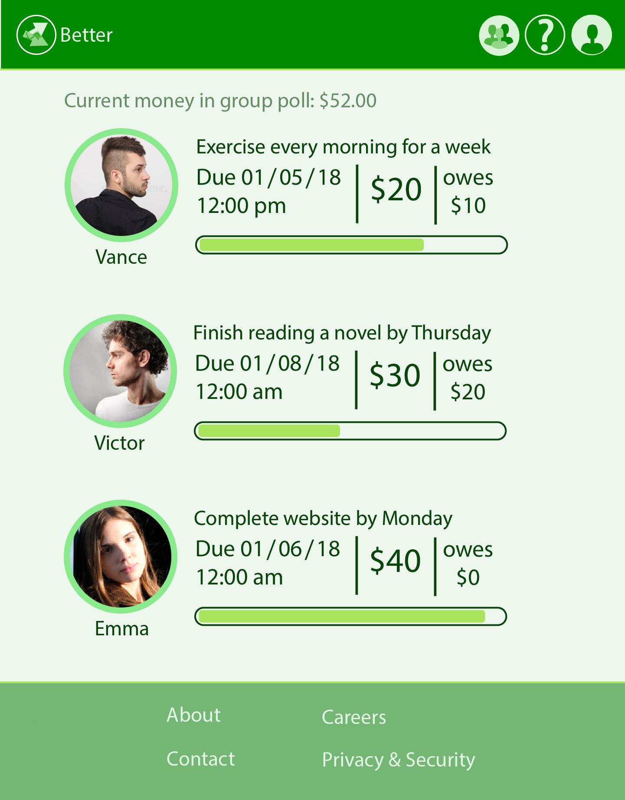

# Better



A self-improvement platform for putting your money where your mouth is!

Here's how it works:

1. Create a pool with your friends, family, or coworkers.
2. Bet money towards any goal.

If you don't complete your goal, then you lose and your money goes into the pool.
However, if you do complete your goal, then get your money back and split the pool!

> Pro tip: The bigger you bet, the more you can win...

Built in 36 hours for [QHacks 2018](https://qhacks2018.devpost.com/).

## Setup

```bash
# install dependencies
npm install

# serve with hot reload at localhost:8080
npm run dev

# build for production with minification
npm run build
```

For detailed explanation on how things work, consult the [docs for vue-loader](http://vuejs.github.io/vue-loader).

## Awards

- Balsamiq Prize: Awarded for the best designed hack!

See the [Devpost submission](https://devpost.com/software/better).

## Authors

- Clara Chen (Designer)
- Jerry Yuan Chen (Programmer)
- Taihyun Lee (Programmer)
- Victor Zhuoyue Shi (Programmer)
